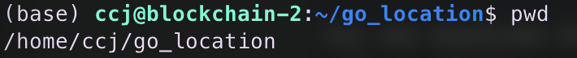

# HW0-Environment Set Up

This assignment aims to guide you to learn how to install and set up the Golang environment. Please follow the following steps to build up your Golang environment.

## Installation

You could refer to the [official website](https://go.dev/doc/install) to get the details of installation. Here we give the main steps to install Golang for different operating systems.

### MacOS

Go to the official website and download the dmg package. 


On the detailed page of installation, you are asked to select a version to download, like


If you are unsure what kind of version you should download, go to Apple Icon->About This Mac. You should be able to select the correct version according to the chip and OS version of your Mac. In the example shown as follows, the chip is Apple M1 and the OS version is 13.0.1, so the second one should be selected.


The final step is clicking the downloaded dmg package and then completing the installation. You can verify whether the installation is successful or not by running `go version` in the Terminal. If it outputs the following log, then you successfully install Golang. 


### Ubuntu

Firstly, click the `Download` button on the official installation website, and choose the following package to download.


You can download this package in Ubuntu by `wget` command. For instance, you get the link address of this package as follows


Then in Ubuntu’s terminal, run the following command to download the package:

```
sudo wget https://go.dev/dl/go1.21.3.linux-amd64.tar.gz
```

where `https://go.dev/dl/go1.21.3.linux-amd64.tar.gz` is the copied link address. Subsequently, run the following content to decompress it:

```
tar -xzf go1.21.3.linux-amd64.tar.gz
```

You are expected to see a directory named `go` in the current directory.


Run `pwd` to get the path of the directory where `go` is located at:



Next, add the following content to the end of `~/.bashrc`:

```
export PATH=$PATH:your_path/go/bin
```

You can utilize `vim` to modify `~/.bashrc`. Specifically, run `vim ~/.bashrc` to view the file, then type keyboard “i” to enter the edit mode. After you add the code to the end of the file, type keyboard “esc+:+w+q+enter” to save the modification and quit `vim`. If your find it difficult to use `vim`, you can use `gedit` command to modify. Specifically, run `gedit ~/.bashrc` and it provides a GUI for you to modify the file easily.

Importantly, you need to replace the `your_path` to the content outputed by `pwd` command. For instance, in case of the output shown by the last picture, the correct content should be 

```
export PATH=$PATH:/home/ccj/go_location/go/bin
```

Finally, run `go version` to check whether the installation is successful.


## The Hello World Program

In this section, you get started with the Hello World program. Initially, you can set up the workspace of the Golang program by running the following commands.

```
mkdir $HOME/gowork
export GOPATH=$HOME/gowork
export PATH=$PATH:$GOPATH/bin
```

Then you could run `go env` to check whether the workspace is correctly set up.


Subsequently, we create a directory for our Hello World program by following commands:

```
mkdir -p $GOPATH/src/github.com/Hide-on-bush2/hello
```

Golang relies on `mod` to manage the dependencies among different files. Specifically, when your code imports packages contained in other modules, you manage those dependencies through your code's own module. That module is defined by a `go.mod` file that tracks the modules that provide those packages. That `go.mod` file stays with your code, including in your source code repository. To enable dependency tracking for your code by creating a `go.mod` file, run the `go mod init` command, giving it the name of the module your code will be in. The name is the module's module path. For instance, we run 

```
go mod init github.com/Hide-on-bush2/hello
```

The expected response is as follows:


Then you should go into the directory `github.com/Hide-on-bush2/hello` and create a file `hello.go` with the following content:

```
package main

import "fmt"

func main() {
	fmt.Printf("Hello, world.\n")
}
```

Congratulations! Now you are able to run your first program by running `go run .`, you are expected to get the output as follows. 


There are other options to run a Go program. Specifically, if you want to run Hello World in other directories, you are advised to run `go install github.com/Hide-on-bush2/hello`, which enables you to run Hello World by running `hello` in whatever directory you are located at.

## Create a Library

Putting all codes into one file makes a program hard to manage and test. A better strategy is that codes of different modules are distributed into different files. A file could provide implemented functionalities for other files, referred to as a library. In this section, we provide the basic guidance for you to create the first library.

Firstly, we create a directory for our library.

```
mkdir $GOPATH/src/github.com/Hide-on-bush2/stringutil
```

Within this directory, we create a file `reverse.go` containing the following content:

```
package stringutil

func Reverse(s string) string {
	r := []rune(s)
	for i, j := 0, len(r)-1; i < len(r)/2; i, j = i+1, j-1 {
		r[i], r[j] = r[j], r[i]
	}
	return string(r)
}
```

Similarly, we init the `mod` for this package

```
go mod init github.com/Hide-on-bush2/stringutil
```

Then we run the following command to compile the package:

```
go install github.com/Hide-on-bush2/stringutil
```

We now successfully create our first library, and then we try to import it into our Hello World program. Modify the `hello.go` as follows:

```
package main
import (
	"fmt"
	"github.com/Hide-on-bush2/stringutil"
)

func main() {
	fmt.Printf(stringutil.Reverse("!oG ,olleH"))
}
```

We import `stringutil` by the code of line 4. However, in the latest version of Golang, the compiler will find the declaimed package, `github.com/Hide-on-bush2/stringutil`, from the Github depository. The target package still remains locally. To import packages locally, we can modify the path to find the package manually. For instance, we run the following command to replace the path with `../stringutil`, which is a local directory.

```
go mod edit -replace github.com/Hide-on-bush2/stringutil=../stringutil
```

Run `go install github.com/Hide-on-bush2/hello` to compile the program and `hello` to run it. 

## Test

In this section, you are guided to write an unit test for the `stringutil` package. Specifically, create a file `reverse_test.go` in `stringutil` directory, containing the following content:

```
package stringutil

import "testing"

func TestReverse(t *testing.T) {
	cases := []struct {
		in, want string
	}{
		{"Hello, world", "dlrow ,olleH"},
		{"Hello, 世界", "界世 ,olleH"},
		{"", ""},
	}
	for _, c := range cases {
		got := Reverse(c.in)
		if got != c.want {
			t.Errorf("Reverse(%q) == %q, want %q", c.in, got, c.want)
		}
	}
}
```

Now you are able to check whether your implementation passes the designed unit test by runging 

```
go test github.com/Hide-on-bush2/stringutil
```

If you are locating at the `stringutil` directory, you can achieve the same goal by running `go test`

The expected output is as follows:


