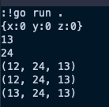

# HW1: Learning Golang

## Arrays, Slices, and Maps

### Arrays

Code:

Output:

Analysis: this code first initializes two arrays `names` and `primes`. `names` contains two empty `string` data, while `primes` initially has 6 `int` data containing `2, 3, 5, 7, 11, 13`. Then we print the content of these arrays and get expected results.

### Slices

Code: 

Output:

Analysis: this code initializes an empty slice `names` and subsequently add a string `sparky` to it. To valiadate this functionality, we print the content of `names` and get the expected output. Secondly, we can initialize a slice with specific capability, emphasized by the code `names2 := make([]string, 8)`, which creates a slice initialized with 8 empty strings. We can also obtain the length of a slice by calling `len`.

### Maps

Code:

Output:

Analysis: this code aims to illustrate how to use embeded implementation in Golang to initiliza a `map` datatype, which enables you to access the wanted data via a `key` with O(1) time complexity. Initially, an empty map `m` is created. After inserting an integer `10` with key `ten` to it, you can access data `10` by indexing `m` with key `ten` at any time. You can also delete a specific item in a map by calling `delete` function. You are suggested not to access an item after deleting it. If you do that, you get a wrong data which is usually the default value of that specific datatype (for example, the default value of `int` is `0`). You can identify whether an item with a specific key exits through the second returned parameter. Specifically, in case of `ten_check, ok := m["ten]`, if the item exits, then `ok` is `true` and `ten_check` is the exact value of the item; if the item does not exit, then `ok` is `false` and `ten_check` is the default value of datatype `int`.

## Structs

Code:

Output:

## Interfaces

Code:

Output:

## Errors

Hint: you must first import `errors` package.

Code: 

Output:

## Cocurrency

### Goroutines

Code: 

Output: it seems that `fmt.Printf` in Gorountines will not print content in the standard output.

### Channel

Code:

Output: 

Code:

Output:

Code:

Output: 

## Mutex

Hint: you must first import `sync` and `time` package.

Code: 

Output:

Code:

Output:

