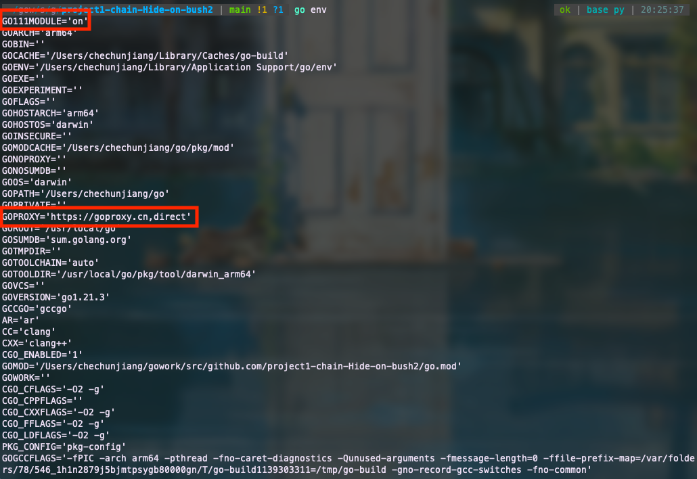
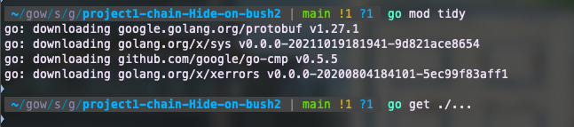
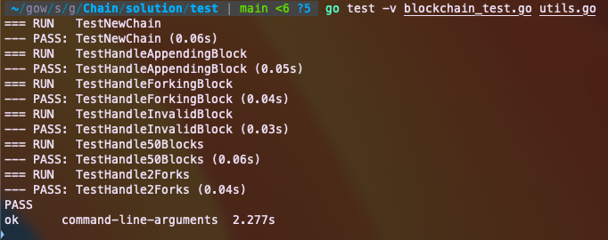
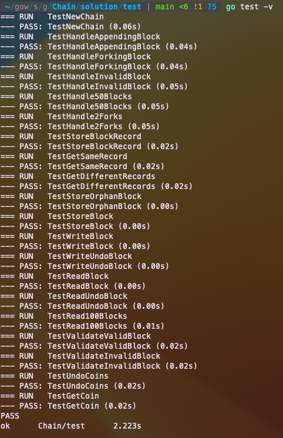

# HW2-Chain

## Introduction

Chain is an example storage system (a blockchain) for a cryptocurrency. Chain is modeled after [Bitcoin’s storage system](https://en.bitcoin.it/wiki/Bitcoin_Core_0.11_(ch_2):_Data_Storage), though heavily simplified. The goal of this project is to give you a taste of the many working components of a blockchain.

### Components

Chain consists of several main components. Here’s a quick overview:

* ***Blockchain***: The main type of this project, BlockChain is a blockchain that stores and validates Blocks. It manages and updates its main chain based on the Blocks it receives. Watch out for forks!
* ***BlockInfoDatabase***: The BlockInfoDatabase is a wrapper for a [LevelDB](https://en.wikipedia.org/wiki/LevelDB), storing information about each Block it receives in the form of a BlockRecord. In addition, each BlockRecord contains storage information for an UndoBlock, which provides additional information to revert a Block, should a fork occur.
* ***ChainWriter***: The ChainWriter takes care of all I/O for the BlockChain. It writes and reads Blocks and UndoBlocks to Disk.
* ***CoinDatabase***: CoinDatabase stores all UTXO information. It contains a cache of Coins and a LevelDB of CoinRecords. A Coin is a wrapper for a UTXO, and a CoinRecord is a record of all the UTXO created by a Transaction. Validation needs to be as quick as possible, which is why the CoinDatabase contains an in-memory cache in addition to a persistent database. Eventually, the cache becomes too large, at which point the CoinDatabase must flush its cache to its database.

## Setup

1. Download and copy the directory `Chain` to your Golang workspace.
2. Because of the fireworks, we must add a domestic proxy of Golang. We can achieve this by running the following commands
```
go env -w GO111MODULE=on
go env -w GOPROXY=https://goproxy.cn,direct
```
You can check whether these commands work by running `go env` and check two variables in the list.



3. Go to the cloned repository and run `go mod tidy` or `go get ./...` to download all the required packages. The expected output is as follows:



## Assignments

For this assignment, you will implement the functions listed below. We recommend that you tackle them in the following order:

* StoreBlockRecord
* GetBlockRecord
* WriteBlock
* WriteUndoBlock
* StoreBlock
* UndoCoins
* HandeBlock

### (1) blockinfodatabase.go

#### Protocol Buffers:

* Protocol buffers (protobufs) are Google’s “language-neutral, platform-neutral, extensible mechanism for serializing structured data” ([docs](https://developers.google.com/protocol-buffers)). In other words, protobufs are a friendly, efficient way to exchange data.
* Protobufs are similar to how json is used for transmitting data across web applications. Read a comparison between the two [here](https://stackoverflow.com/questions/52409579/protocol-buffer-vs-json-when-to-choose-one-over-another).

#### Why do we have local structs if we’re using protobufs?

Good question. Normally, when using protobufs, you would probably NOT create redundant local structs. After all, if you have a well-defined message format, why would you rewrite the same format? The answers is that these redundant local structs are easier to work with. That means less headaches for you.

#### BlockRecords:

BlockRecords contain information on where a Block and its UndoBlock are stored on disk. Its structure is as follows:

* Header - the block’s header
* Height - the block’s height
* NumberOfTransactions is the number of Transactions in the Block.
* BlockFile is the name of the file where the Block is stored.
* BlockStartOffset is the starting offset of the Block within the BlockFile.
* BlockEndOffset is the ending offset of the Block within the BlockFile.
* UndoFile is the name of the file where the UndoBlock is stored.
* UndoStartOffset is the starting offset of the UndoBlock within the UndoFile.
* UndoEndOffset is the ending offset of the UndoBlock within the UndoFile.

#### Implementation tast 1:
You must implement the function `StoreBlockRecord` in file `Chain/pkg/blockchain/blockinfodatabase/blockinfodatabase.go`, which is declaimed as 
```
// StoreBlockRecord stores a block record in the block info database.
func (blockInfoDB *BlockInfoDatabase) StoreBlockRecord(hash string, blockRecord *BlockRecord)
```
As suggested by this function’s name, the purpose of `StoreBlockRecord`` is to store block records in the BlockInfoDatabase.

In order to do this, we’ll need to 1) encode the `BlockRecord` as a protobuf, 2) convert the protobuf to the correct format and type (`byte[]`) so that it can be inserted into the database, and 3), put the block record into the database.

Helpful functions:
* `func EncodeBlockRecord(br *BlockRecord) *pro.BlockRecord`
* `proto’s func Marshal(m Message) ([]byte, error)`. See documentation [here](https://pkg.go.dev/github.com/golang/protobuf/proto#Marshal).
* leveldb’s `func (db *DB) Put(key, value []byte, wo *opt.WriteOptions) error`. See documentation [here](https://pkg.go.dev/github.com/syndtr/goleveldb/leveldb#pkg-functions/).

#### Implementation task 2:

You must implement the function `GetBlockRecord` in file `Chain/pkg/blockchain/blockinfodatabase/blockinfodatabase.go`, which is declaimed as 
```
// GetBlockRecord returns a BlockRecord from the BlockInfoDatabase given
// the relevant block's hash.
func (blockInfoDB *BlockInfoDatabase) GetBlockRecord(hash string) *BlockRecord
```

This function retrieves block records from the database, and returns the block record.

In order to do this, we’ll basically do the reverse of what we did in `StoreBlockRecord`. Specifically, we’ll 1) retrieve the block record from the database, 2) Convert the `byte[]` returned by the database to a protobuf, and 3) convert the protobuf back into a `BlockRecord`.

Helpful functions:
* `func DecodeBlockRecord(pbr *pro.BlockRecord) *BlockRecord`
* proto’s `func Unmarshal(b []byte, m Message) error`. See documentation [here](https://pkg.go.dev/github.com/golang/protobuf/proto#Unmarshal).
* leveldb’s `func (db *DB) Get(key []byte, ro *opt.ReadOptions) (value []byte, err error)`. See documentation [here](https://pkg.go.dev/github.com/syndtr/goleveldb/leveldb#pkg-functions/) and be sure to account for the corresponding I/O errors.


### (2) chainwriter.go

#### So what’s an UndoBlock?

* An UndoBlock is an object that contains information necessary for reverting a specific block. Thus, each Block has an accompanying UndoBlock.
* When handling Blocks, forks will occasionally supplant the current, main chain. When this happens, our CoinDatabase (akin to Bitcoin’s UTXO Set) is out of date, and we need to update it to reflect the fork.
* You may be asking yourself: why do I need to update the CoinDatabase? When a fork occurs, the forked blocks (almost always) contain a different set of transactions than the current blocks. This means that both the inputs used and the outputs created by the forked blocks are different than what our CoinDatabase currently reflects.
* UndoBlocks help us revert spent Coins, (re)making them valid inputs for future transactions.

#### Implementation task 3&4

You must implement two functions `WriteBlock` and `WriteUndoBlock` in file `Chain/pkg/blockchain/chainwriter/chainwriter.go`, which are declaimed as 

```
// WriteBlock writes a serialized Block to Disk and returns
// a FileInfo for storage information.
func (cw *ChainWriter) WriteBlock(serializedBlock []byte) *FileInfo
```

```
// WriteUndoBlock writes a serialized UndoBlock to Disk and returns
// a FileInfo for storage information.
func (cw *ChainWriter) WriteUndoBlock(serializedUndoBlock []byte) *FileInfo
```

Note: These two functions are nearly identical. Think about which ChainWriter fields you’re modifying.

Hints:
* Before writing a block to a file, make sure to check that doing so will not cause the file to be larger than the maximum allowable file size. If your Block/UndoBlock is too large to store in the current file, you’ll have to update where you’re writing to!
    * In order to update the file you’re writing to, you should increment the `cw.CurrentBlockFileNumber` by one.
* You should use the following naming convention for your files: `dataDirectory/fileName_fileNumber.<file extension>`
* Make sure that you’re updating relevant `ChainWriter` fields as appropriate

Helpful functions:
* `writeToDisk(fileName, serializedBlock)`

### coindatabase.go

#### Cache vs Database

* To improve efficency, a cache (stored in RAM) is used for storing and reading newer coins before putting them in the database since reading from the database (stored on disk) is [slow in comparison (milli vs nano)](https://stackoverflow.com/questions/1371400/how-much-faster-is-the-memory-usually-than-the-disk#:~:text=Random%20Access%20Memory%20(RAM)%20takes,speed%20is%20measured%20in%20milliseconds.).
* However, a cache cannot hold as much data as the database. So once our cache is full, we empty the data from the cache into the db (called flushing). With an empty cache, our Cache can now accept new Coins.
    * Our flushing mechanism is NOT efficient. You can read more about cache replacement policies [here](https://en.wikipedia.org/wiki/Cache_replacement_policies).
* Note: when you store a block, you should store its UTXOs in both the DB and the Cache. The main reason for the cache is for quick validation and UTXO updates.

#### Understanding Reverting a Block

Brief visual of reverting a block [here](https://youtu.be/mQEGhmI5epE) :)

#### Implementation task 5

You must implement the function `StoreBlock` in file `Chain/pkg/blockchain/coindatabase/coindatabase.go`, which is declaimed as 

```
// StoreBlock handles storing a newly minted Block. It:
// (1) removes spent TransactionOutputs
// (2) stores new TransactionOutputs as Coins in the mainCache
// (3) stores CoinRecords for the Transactions in the db.
// We recommend you write a helper function for each subtask. 
func (coinDB *CoinDatabase) StoreBlock(transactions []*block.Transaction)
```

Hints: when removing spent TransactionOutputs, if a Coin is in the mainCache, we should simply mark the Coin as spent. This will cause the Coin to be removed from its CoinRecord in the database next time the mainCache is flushed. If a coin is not in the cache, we should directly remove the Coin from its CoinRecord in the database.

Helpful functions:
* `makeCoinLocator(txi *block.TransactionInput)`
* `coinDB.removeCoinFromDB(txHash string, cl CoinLocator)`
* `coinDB.FlushMainCache()`
* `coinDB.createCoinRecord(tx *block.Transaction, active bool)`
* `coinDB.putRecordInDB(txHash string, cr *CoinRecord)`

#### Implementation task 6

You must implement the function `UndoCoins` in file `Chain/pkg/blockchain/coindatabase/coindatabase.go`, which is declaimed as 

```
// UndoCoins handles reverting a Block. It:
// (1) erases the Coins created by a Block and
// (2) marks the Coins used to create those Transactions as unspent.
func (coinDB *CoinDatabase) UndoCoins(blocks []*block.Block, undoBlocks []*chainwriter.UndoBlock)
```

Helpful functions:
* `coinDB.removeCoinFromRecord(cr *CoinRecord, outputIndex uint32)`
* levelDB’s `Delete(key []byte, wo *opt.WriteOptions)`
* `coinDB.getCoinRecordFromDB(txHash string)`
* `coinDB.addCoinsToRecord(cr *CoinRecord, ub chainwriter.UndoBlock)`
* `coinDB.putRecordInDB(txHash string, cr *CoinRecord)`

### blockchain.go

#### Implementation task 7

You must implement the function `handleBlock` in file `Chain/pkg/blockchain/blockchain.go`, which is declaimed as

```
// HandleBlock handles a new Block. At a high level, it:
// (1) If valid, appends the Block onto the active chain.
// (2) Stores the Block and resulting Undoblock to Disk.
// (3) Stores the BlockRecord in the BlockInfoDatabase.
// (4) Handles a fork, if necessary.
// (5) Updates the BlockChain's fields.
func (bc *BlockChain) HandleBlock(block *block.Block)
```

Helpful functions:
* There are several helpful functions in `blockchain.go` that we’ve crafted to make your life easier. Make sure you understand what each one is doing!
* Remember, you will be using functions declared in other Chain packages. Make sure to navigate the code base to find out what might be useful for you.

Additional notes:
* In our implementation, we store the unsafe hashes in a queue, where `unsafeHashes[0]` is the least recent hash. This means that when updating `unsafeHashes`, we pop from the front (but should we always pop?) and push to the back of the slice. The helper function `getForkedBlocks` handles unsafeHashes as such. If you decide to keep track of unsafe hashes differently, `getForkedBlocks` will not behave as expected. In that case, feel free to update `getForkedBlocks`!
* We use `unsafeHashes` and `maxHashes = 6` as a heuristic for how many blocks back we need to check to find the origin of a fork. While in real life there is an infinitesimal chance that a Bitcoin fork requires a node to search back beyond 6 blocks, it’s still possible! Such an event would (unfortunately) break our implementation.
* This function (along with `UndoCoins()`) is somewhat complicated and long. If you’re stuck, collaborate with your peers or come to TA hours!

## Testing 

We have provided all test functions in the files under `Chain/test`, and each testing file corresponds to a file to be completed. For instance, `blockinfodatabase_test.go` is responsible for testing `blockinfodatabase.go`. In addition, you should write your own tests when things aren’t working! We have provided several helper functions in `test/utils.go`.

In the `test` directory, run the following command to perform unit test for each module:

```
go test -v {module}_test.go utils.go
```

For instance, if you want to test `blockchain` module, run `go test -v blockchain_test.go utils.go`. If your implementation passes all the testing functions, the expected result is as follows:



You can also test all modules at the same time by running `go test -v`, the expected output is as follows:



## Grading

Your score is based on the number of testing functions your implementation passes. 

### Blockchain 

|Test Function|	Points|
|:-|:-:|
|TestHandleAppendingBlock|	5|
|TestHandleInvalidBlock|	5|
|TestHandle50Blocks	|5|
|TestHandleForkingBlock	|10|
|TestHandle2Forks	|10|
|Total	|35|

### BlockInfoDatabase

|Test Function|	Points|
|:-|:-:|
|TestGetSameRecord|	5|
|TestGetDifferentRecords|	5|
|Total|	10|

### ChainWriter

|Test Function|	Points|
|:-|:-:|
|TestReadBlock|	5|
|TestReadUndoBlock|	5|
|TestRead100Blocks|	5|
|TestStoreOrphanBlock|	5|
|TestStoreBlock|	5|
|TestWriteBlock|	5|
|TestWriteBlockSwitchesFiles|	5|
|TestWriteUndoBlock|	5|
|TestWriteUndoBlockSwitchesFiles|	5|
|Total|	45|

### CoinDatabase


|Test Function|	Points|
|:-|:-:|
|TestGetCoin|	5|
|TestUndoCoins	|5|
|TestUpdateSpentCoinsInCache	|5|
|TestUpdateSpentCoinsNotInCache	|5|
|TestValidateValidBlock	|5|
|TestValidateInvalidBlock	|5|
|TestCacheFlushedWhenFull	|10|
|TestCoinsStoredInCacheAndDB	|10|
|Total	|50|

## Demo Video

