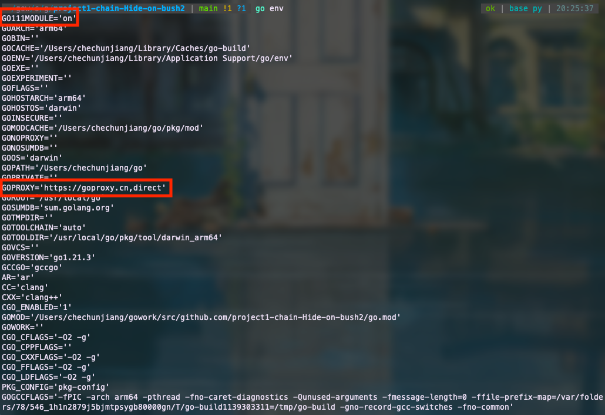
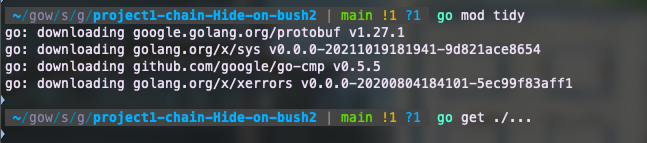
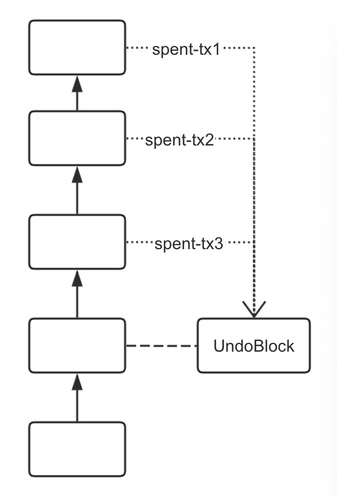

# HW2-Chain

## Introduction

Chain is an example storage system (a blockchain) for a cryptocurrency. Chain is modeled after [Bitcoin’s storage system](https://en.bitcoin.it/wiki/Bitcoin_Core_0.11_(ch_2):_Data_Storage), though heavily simplified. The goal of this project is to give you a taste of the many working components of a blockchain.

### Components

Chain consists of several main components. Here’s a quick overview:

* ***Blockchain***: The main type of this project, BlockChain is a blockchain that stores and validates Blocks. It manages and updates its main chain based on the Blocks it receives. Watch out for forks!
* ***BlockInfoDatabase***: The BlockInfoDatabase is a wrapper for a [LevelDB](https://en.wikipedia.org/wiki/LevelDB), storing information about each Block it receives in the form of a BlockRecord. In addition, each BlockRecord contains storage information for an UndoBlock, which provides additional information to revert a Block, should a fork occur.
* ***ChainWriter***: The ChainWriter takes care of all I/O for the BlockChain. It writes and reads Blocks and UndoBlocks to Disk.
* ***CoinDatabase***: CoinDatabase stores all UTXO information. It contains a cache of Coins and a LevelDB of CoinRecords. A Coin is a wrapper for a UTXO, and a CoinRecord is a record of all the UTXO created by a Transaction. Validation needs to be as quick as possible, which is why the CoinDatabase contains an in-memory cache in addition to a persistent database. Eventually, the cache becomes too large, at which point the CoinDatabase must flush its cache to its database.

## Setup

1. Download and copy the directory `Chain` to your Golang workspace.
2. Because of the fireworks, we must add a domestic proxy of Golang. We can achieve this by running the following commands
```
go env -w GO111MODULE=on
go env -w GOPROXY=https://goproxy.cn,direct
```
You can check whether these commands work by running `go env` and check two variables in the list.



3. Go to the cloned repository and run `go mod tidy` or `go get ./...` to download all the required packages. The expected output is as follows:



## Transaction&Block Structure

In this section, you are expected to get familiar with the structures of block and transaction by implementing some simple related functions. Two packages are helpful To complete the implementation. 

###  Protocol Buffers

* Protocol buffers (protobufs) are Google’s “language-neutral, platform-neutral, extensible mechanism for serializing structured data” ([docs](https://developers.google.com/protocol-buffers)). In other words, protobufs are a friendly, efficient way to exchange data.
* Protobufs are similar to how json is used for transmitting data across web applications. Read a comparison between the two [here](https://stackoverflow.com/questions/52409579/protocol-buffer-vs-json-when-to-choose-one-over-another).

#### Why do we have local structs if we’re using protobufs?

Good question. Normally, when using protobufs, you would probably NOT create redundant local structs. After all, if you have a well-defined message format, why would you rewrite the same format? The answers is that these redundant local structs are easier to work with. That means less headaches for you.

#### Why do we use protobufs in this project?

The `protobufs` enables us to serialize and deserialize data structures, which facilitates the followint two operations:

* When we store a block/transaction into the disk, actually we need to store the bytes into the disk rather than the struct itself. That is why we need to use `protobufs` to serialize the block/transaction and transfer it to bytes before storing it into the disk.
* Some cryptographic packages,  such as `sha256`, operate on bytes because it is implemented without assuming a particular data structure. Therefore the serialization of data structure is also needed.

### `crypto/sha256`

The package enables you to use a typical hash function `SHA256` to hash a block/transaction. Please check the official tutorial via [this](https://pkg.go.dev/crypto/sha256).

### Implementation task 1: the coding and hashing of `Transaction` and `Block`

You must implement the following three functions in `Chain/pkg/block/transaction.go` and `Chain/pkg/block/block.go`:

* Task1-1: `func EncodeTransaction(tx *Transaction) *pro.Transaction`
* Task1-2: `func DecodeTransaction(ptx *pro.Transaction) *Transaction`
* Task1-3: `func (tx *Transaction) Hash() string`
* Task1-4: `func EncodeBlock(b *Block) *pro.Block`
* Task1-5: `func DecodeBlock(pb *pro.Block) *Block`
* Task1-6: `func (block *Block) Hash() string`

Your implementation is expected to satisfies the following requirements:
* Asuming that a block/tx is initially encoded and subsequently decoded, the output is expected to be the same as the original value.
* The hash values of two different blocks/transactions are different, the hash values of two same blocks/transactions are the same.

Hint:
* The message forms of `Transaction`, `TransactionInput`, `TransactionOutput`, `Header`, and `Block` are well-defined in `Chain/pkg/pro/Chain.proto`, you dont need to define them again. Additionally, we provide useful interfaces of these message in `Chain/pkg/pro/Chain.pb.go`, you can use these interfaces to access the value of the message.
* As a `Transaction` consists of multiple `TransactionInput` and `TransactionOutput`, it is better to implement the functions of `TransactionInput` and `TransactionOutput` first, and then utilize these functions to implement those of `Transaction`. You can adopt the same idea to implement the functions of `Block`.

Helpful functions:
* The interfaces provided in `Chain/pkg/pro/Chain.pb.go`. You can get the value of a `protobuf` messafe by these interfaces. For instance, you can get the `OutputIndex` of the `ptx` of type  `pro.TransactionInput` by `ptx.GetOutputIndex()`
* `proto.Marshal`. It can serialize a `pro.Transaction`/`pro.Block` to a byte array.
* `h := sha256.New()` & `h.Write`. The functions provided in the `sha` package are well-impelemented to achieve the SHA256 hashing scheme. Check the official tutorial for further usage.


## Blockchain Status: `UndoBlock` and `CoinDatabase`

A blockchai's status is important to the verification of the coming blocks. In other words, we need to check whether the transactions in the coming blocks double-spends the coins stored in the previous blocks. In this second you are expeceted to learn about the concept of `UndoBlock`, which is significant to understand the status updating scheme in the project. Check the definition of `UndoBlock` in `Chain/pkg/blockchain/chainwriter/undoblock.go`.

### So what’s an UndoBlock?

* An UndoBlock is an object that contains information necessary for reverting a specific block. Thus, each Block has an accompanying UndoBlock.
* When handling Blocks, forks will occasionally supplant the current, main chain. When this happens, our CoinDatabase (akin to Bitcoin’s UTXO Set) is out of date, and we need to update it to reflect the fork.
* You may be asking yourself: why do I need to update the CoinDatabase? When a fork occurs, the forked blocks (almost always) contain a different set of transactions than the current blocks. This means that both the inputs used and the outputs created by the forked blocks are different than what our CoinDatabase currently reflects.
* UndoBlocks help us revert spent Coins, (re)making them valid inputs for future transactions.

According to the UTXO model, a transaction in a block will consume some outputs of the transaction in the previous blocks. A undoblock records these transactions outputs, providing sufficient information for fast positioning when reverting a block. The key concept is illustrated in the following figure:



### Implementation task 2: generation of `UndoBlock`

You must implement the following function in `Chain/pkg/blockchain/blockchain.go`:

* `func (bc *Blockchain) makeUndoBlock(txs []*block.Transaction) *chainwriter.UndoBlock`

Hint: 
* An output of a transaction is referred to a "coin". You can access a coin in the `coindatabase` via the hash value of the associated transaction and the index of the output in that transaction. 

Helpful function
* `cl := coindatabase.CoinLocator{...}` and `coin := bc.CoinDB.GetCoin(cl)`, where `bc` is of type `*Blockchain`. This function enables you to access coins stored in the coindatabase. You must provide the coresponding hash value and output index in `...`. 

### So what’s an CoinDatabase?

`CoinDatabase` records all valid UTXOs(unspent transaction outputs). It enables fast verification of double spending. When verifying a new tx, if all the inputs consume the UTXOs stored in the `CoinDatabase`, it is valid otherwise it is invalid. Basically, we need to update the `CoinDatabase` whenever the blockchain is changed, such as insertion of new blocks and forking occurence. 

#### Cache vs Database

* To improve efficency, a cache (stored in RAM) is used for storing and reading newer coins before putting them in the database since reading from the database (stored on disk) is [slow in comparison (milli vs nano)](https://stackoverflow.com/questions/1371400/how-much-faster-is-the-memory-usually-than-the-disk#:~:text=Random%20Access%20Memory%20(RAM)%20takes,speed%20is%20measured%20in%20milliseconds.).
* However, a cache cannot hold as much data as the database. So once our cache is full, we empty the data from the cache into the db (called flushing). With an empty cache, our Cache can now accept new Coins.
    * Our flushing mechanism is NOT efficient. You can read more about cache replacement policies [here](https://en.wikipedia.org/wiki/Cache_replacement_policies).
* Note: when you store a block, you should store its UTXOs in both the DB and the Cache. The main reason for the cache is for quick validation and UTXO updates.

### Implementation task 3: adding new UTXOs to `CoinDatabase`

You must implement the following function in `Chain/pkg/blockchain/coindatabase/coindatabase.go`:

* `func (coinDB *CoinDatabase) updateSpentCoins(transactions []*block.Transaction)`

This function aims to remove all the newly spent coins from the main cache or disk when new transactions are added into the blockchain, specifically in case of insertion of new blocks.

Hint: 
* We employ a lazy mechanism for maintaining the status of a coin. Specifically, each coin has a field `IsSpent` to identify whether the coin is spent. That means you just need to change this field to remove the coin from the main cache.

Helpful functions
* `makeCoinLocator`. It generates an iterator to the coin via a transaction input.
* `removeCoinFromDB`. It removes the coin with the provided hash value from the disk

### Implementation task 4: reverting a block

The task 4 requires you to update the available coins when inserting a block, while the task 4 requires you to update the available coins when reverting a block. This will happen when a fork occurs. In this task, you must implement the following function in `Chain/pkg/blockchain/coindatabase/coindatabase.go`:
* `func (coinDB *CoinDatabase) UndoCoins(blocks []*block.Block, undoBlocks []*chainwriter.UndoBlock)` 

Hint:
* The outputs of the transactions in the reverted block should be removed from the `CoinDatabase`
* The previous spent transactions consumed by the transactions in the reverted block should be added into the `CoinDatabase`

Helpful functions:

* `coinDB.removeCoinFromRecord(cr *CoinRecord, outputIndex uint32)`
* levelDB’s `Delete(key []byte, wo *opt.WriteOptions)`
* `coinDB.getCoinRecordFromDB(txHash string)`
* `coinDB.addCoinsToRecord(cr *CoinRecord, ub chainwriter.UndoBlock)`
* `coinDB.putRecordInDB(txHash string, cr *CoinRecord)`

## Block Validation 

When receiving a new block, node should verify the validity of this block, to see whether there is a double spending event. In this section, you are expected to understand how to prevent double spending.

### Implementation task 5: verifying a block

You must implement the following function in `Chain/pkg/blockchain/coindatabase/coindatabase.go`:

* `func (CoinDB *CoinDatabase) validateTransaction(transaction *block.Transaction) error`

Hint: 
* Check whether the coins consumed by the inputs of the transaction are available in `CoinDatabase`, if it is, it is valid otherwise it is invalid.

Helpful functions:
* `coinDB.db.get`
* `proto.Unmarshal`

## Handling Forking Occurrence

Forking occurs frequently over the execution of blockchain. In this section you are expected to get familiar with how to handle the forking occurence. 

## Implementation task 6: handling forks

You must implement the following functions in `Chain/pkg/blockchain/blockchain.go`:

* `func (bc *BlockChain) handleFork(b *block.Block, blockhash string, height uint32)`

Hint: 
* When a fork appers, multiple blocks will become the new blocks in the main chain while some blocks are reverted. For each reverted block, we need to update the corresponding coin status. Utilize the implemented functions in the previous tasks to help you.

Helpful functions:
* `getForkedBlocks`
* `getBlockAndUndoBlocks`
* `validateBlock`. This function will call `validateTransaction` to validate each transaction in the block.
* `StoreBlock`. This function will store the transaction into `CoinDatabase` and call `UpdateSpentCoins` to update the available coins.
 
## Integration

Now we are able to combine all the components and define a complete logic of nodes.

### Implementation task 7

You must implement the following functions in `Chain/pkg/blockchain/blockchain.go`:
* `func (bc *BlockChain) HandleBlock(b *block.Block)` 

Hint:
* Besides the `CoinDatabase`, we should need to store the block to `BlockInfoDB`. Dont worry! We have provided well-implemented functions to facilitate your implementation.

Helpful functions
* `appendsToActiveChain`
* `GetBlockRecord`
* `bc.ChainWriter.StoreBlock`
* `bc.BlockInfoDB.StoreBlockRecord`
